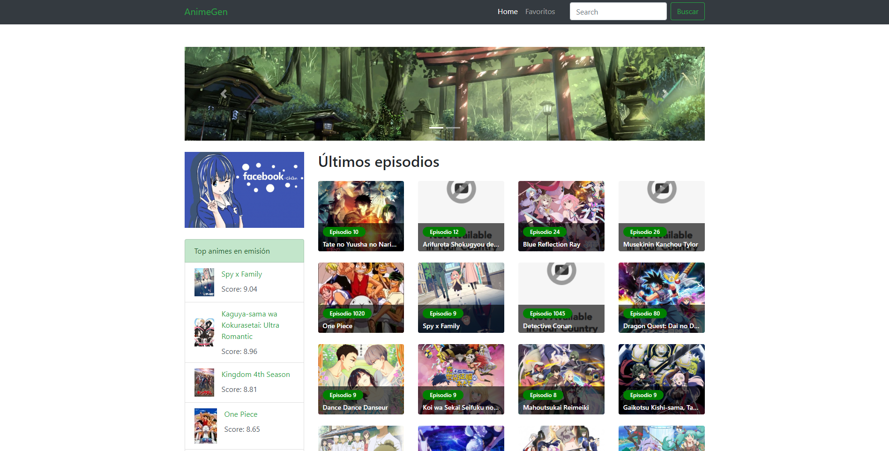

# Jikan API

Página web utilizando HTML, CSS y JavaScript, consumiendo los datos de la Jikan API 

    

        
    

## GitHub pages

* https://jonathan-yv.github.io/jikan-api/

## Autor ✒️

* **Jonathan Yair Vazquez Uriostegui**